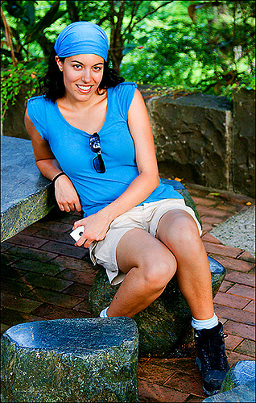

Mini-BLIP2 图像描述生成复现实验报告
1. 论文信息
论文名称：BLIP-2: Bootstrapping Language-Image Pre-training with Frozen Image Encoders and Large Language Models
论文地址：https://arxiv.org/abs/2301.12597
2. 任务说明
本实验复现的任务是图像描述生成 Image Captioning。

输入：图片
输出：英文 caption

3. 数据集
数据集名称：Flickr8k
数据集地址：https://www.kaggle.com/datasets/adityajn105/flickr8k
实际使用数据量：前 200 张图片
4. 模型结构
请说明自己的 Mini-BLIP2 结构，

Image → Frozen Vision Encoder → Mini Q-Former → Projection Layer → Frozen Language Decoder → Caption

填写使用的视觉编码器，
openai/clip-vit-base-patch32。

4.2 Mini Q-Former
说明自己实现的 Mini Q-Former：
query token 数量：32
hidden size：768
Transformer 层数：6

是否使用 cross-attention：是
实现方式：使用 nn.TransformerDecoderLayer 堆叠，可学习的 query 作为 tgt，图像特征作为 memory

4.3 Language Decoder
facebook/opt-125m

5. 训练设置
训练数据量：200
epoch：2
batch size：8
learning rate：1e-4
optimizer：AdamW
loss function：交叉熵
冻结的模块：Vision Encoder、OPT
训练的模块：Mini Q-Former、Projection Layer
6. 训练过程
粘贴训练日志或 loss 变化截图。
Epoch 2/20 - 平均 Loss: 4.2943
Epoch 2/20:   0%|          | 0/125 [00:25<?, ?it/s, loss=4.2980]
Caption IDs: tensor([    2,   250,   333,     9,    82,  2828,    23,    10,  2103,    11,
           10, 38390,   929,   479,     1,     1,     1,     1,     1,     1,
            1,     1,     1,     1,     1,     1,     1,     1,     1,     1])
Decoded text: </s>A group of people sitting at a table in a darkened room .<pad><pad><pad><pad><pad><pad><pad><pad><pad><pad><pad><pad><pad><pad><pad><pad>
Epoch 3/20:   0%|          | 0/125 [00:24<?, ?it/s, loss=4.2858]
Epoch 3/20:   0%|          | 0/125 [00:24<?, ?it/s, loss=4.2858]
Epoch 3/20 - 平均 Loss: 4.2043
Caption IDs: tensor([    2,  9058,    82,    32,    15,    10,  1958,    12, 24914,  6485,
          479,     1,     1,     1,     1,     1,     1,     1,     1,     1,
            1,     1,     1,     1,     1,     1,     1,     1,     1,     1])
Decoded text: </s>Two people are on a snow-covered mountain .<pad><pad><pad><pad><pad><pad><pad><pad><pad><pad><pad><pad><pad><pad><pad><pad><pad><pad><pad>

Epoch	Train Loss
2	4.2943
3	4.2043
7. 生成结果展示
至少展示 3—5 个例子。

图片编号	真实 Caption	模型生成 Caption
1	
真实2878705136_609dfbf318.jpg,A smiling young woman in a tourquoise shirt and bandanna poses at table outdoors .
2878705136_609dfbf318.jpg,A woman dressed in blue posing for a picture
2878705136_609dfbf318.jpg,A woman in a blue shirt and headscarf poses for a picture sitting at a picnic table .
2878705136_609dfbf318.jpg,A woman in a blue shirt and tan shorts sits at a table .
2878705136_609dfbf318.jpg,A woman with matching light blue t-shirt and headscarf sits on a chair made of stone .
生成A girl in a green shirt and a pink pants and a white shirt walks in front of a building
2	
真实2880051254_e0ca96b6be.jpg,A black and white dog runs towards the camera .
2880051254_e0ca96b6be.jpg,A white and black dog runs on the grass .
2880051254_e0ca96b6be.jpg,a white dog jumping towards the camera
2880051254_e0ca96b6be.jpg,Black and white dog running outside .
2880051254_e0ca96b6be.jpg,The white and black dog is on the grass .
生成A dog is running in front of a ball .

3	
2880874989_a33b632924.jpg,a child in a black shirt reaches for a white kitchen stove
2880874989_a33b632924.jpg,A little kid in a black shirt and striped pants is playing with the controls on a stove .
2880874989_a33b632924.jpg,a toddler in stripy pants is reaching for a white stove in a red floored kitchen .
2880874989_a33b632924.jpg,A toddler is reaching up to touch a stove .
2880874989_a33b632924.jpg,The toddler touches the white stove .
生成A boy playing with his hands on a table .
如果方便，可以把图片也插入报告中。

8. 总结
请简要说明：
实验模型可以跑通但生成效果差，生成的 caption 有时与图片内容部分相关，但细节错误较多
是否成功跑通训练；是
生成效果如何：生成效果不理想，生成的 caption 有时与图片内容部分相关，但细节错误较多
遇到了什么问题；测试时输出空字符、
如果继续改进，可以怎么做。使用完整 Flickr8k 数据集
调整 Q-Former 参数 完善模型结构
9. AI 对话过程记录
请填写本次复现过程中与 AI 工具的对话记录（对应 requirements.md 第 9.1 节）。
这个entir不是很会使用，但是我保存了md文件
录制工具：例如 entir.io
对话链接：
使用的 AI 模型：deepseek和chatgpt
累计对话时长 / 会话数：
简要说明 AI 在哪些环节给了帮助、哪些地方是自己独立完成或推翻了 AI 的建议（2—4 句话即可）：
AI 帮助了数据读取、模型构环的编写以及生成时的bug修复
10. Git 提交记录
请填写本次复现的代码仓库与提交历史（对应 requirements.md 第 9.2 节）。

仓库地址：https://github.com/eco369369-max/blip2
总 commit 数： 5
粘贴 git log --oneline 输出（或截图）：
3f3d9d8 (HEAD -> master, origin/master) 训练测试
9fd0271 训练测试
964858b 训练测试
c59606c 训练测试
8047d33 模型
5b56656 数据处理
（在这里粘贴 git log --oneline）